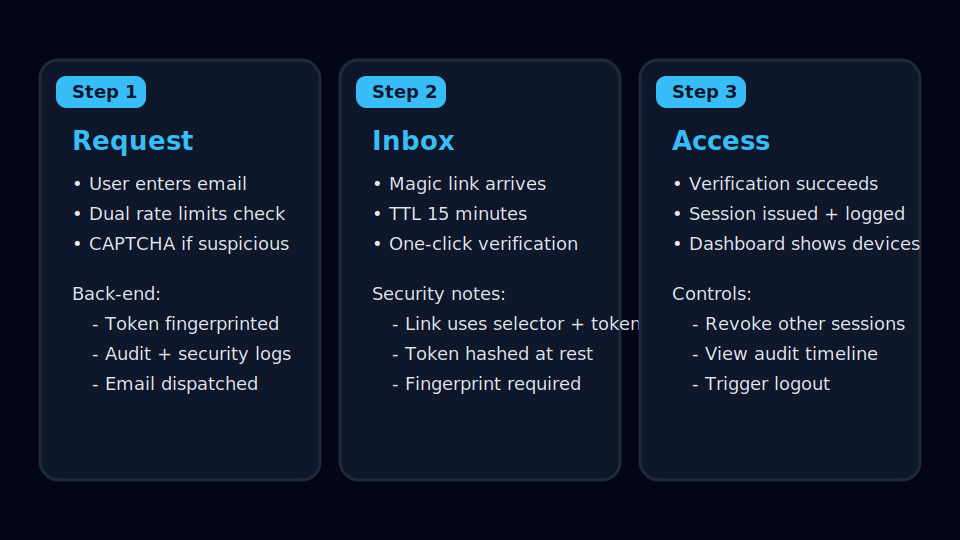
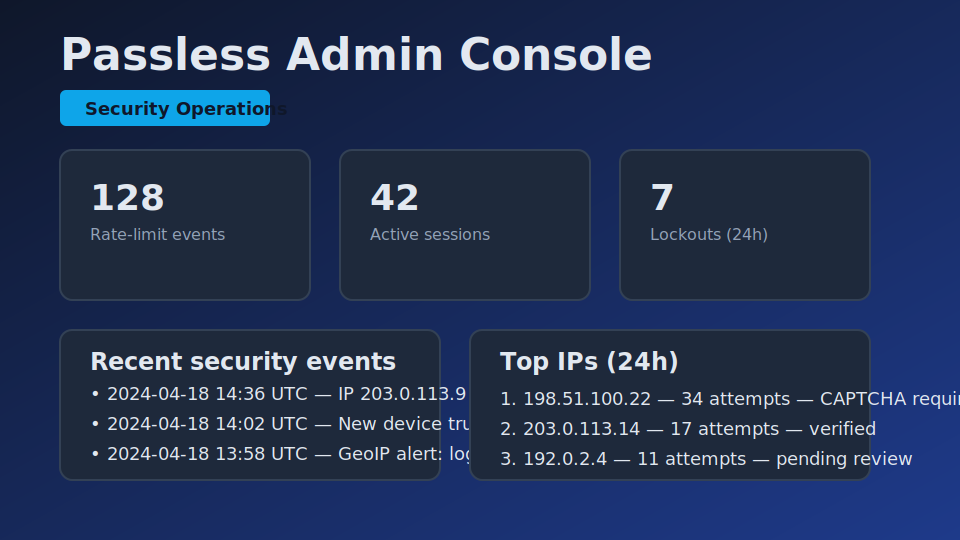
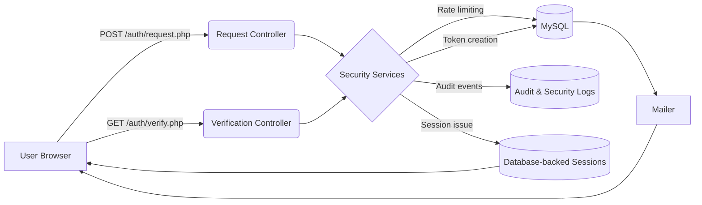

# Passless

**Production-ready passwordless authentication built from first principles.**

[🔗 **Live Demo**](https://lab.minischetti.org/passless)

## Overview
Passless is a security-focused magic link system for engineers who want to demonstrate a deep understanding of authentication flows, abuse prevention, and observability without leaning on frameworks. It runs on shared hosting, modern container platforms, or anything in between.

## Features
- Passwordless login with magic links bound to IP + user agent and invalidated after first use.
- Database-backed sessions with sliding and absolute expirations, device metadata, and self-service revocation.
- Adaptive protections: dual email/IP rate limits, progressive CAPTCHA, account lockouts, and GeoIP alerts.
- Immutable audit logs with structured security events ready for SIEM ingestion or webhook forwarding.
- Admin console highlighting suspicious activity, rate-limit pressure, and recent audit entries.
- Comprehensive documentation, tests, static analysis, and automated deployments via GitHub Actions.

## Tech Stack
- PHP 8 (framework-free, PDO)
- MySQL 8 (SQLite used for automated tests)
- Vanilla JavaScript + modern CSS
- SendGrid or Mailgun for transactional email
- GitHub Actions, Docker Compose, PHPStan, custom PHP test runner

## Design Philosophy
Passless was built to thrive in **constrained environments**:
- Zero build tooling or npm dependencies
- Runs on PHP 8 with standard extensions only
- Compatible with everything from FTP-only shared hosts to Kubernetes

This constraint proves the architecture is fundamentally sound—if it works on shared hosting, it works anywhere. The Docker/Kubernetes deployment guides demonstrate the same security patterns at scale.

## Technology Choices
- **Vanilla PHP:** Demonstrates language fluency without framework scaffolding and keeps the attack surface minimal.
- **MySQL:** Common on shared hosting, supports atomic `INSERT ... ON DUPLICATE KEY UPDATE`, and maps directly to managed offerings.
- **Magic links:** Remove password storage, simplify onboarding, and pair well with fingerprint binding and audit logging.
- **Server-backed sessions:** Make revocation, CSRF protection, and sliding expirations straightforward while remaining portable.

## Why Passless?
This project demonstrates:
- Token hashing, fingerprint binding, rate limiting, and CSRF defense implemented directly in PHP.
- Database schema design that supports audit trails, abuse detection, and session revocation.
- An approachable codebase for interviews or technical deep-dives—no hidden framework magic.
- A live deployment at https://lab.minischetti.org/passless showcasing the production configuration.

**Portfolio note:** For production workloads, evaluate commercial providers such as Auth0, Clerk, or Supabase unless compliance, cost, or air-gapped environments necessitate a bespoke build.

## When to Use Passless vs. SaaS Providers
**Reach for Auth0 / Clerk / Supabase when:**
- Social logins and OAuth integrations are must-haves.
- Your team prioritizes feature velocity over custom control.
- You prefer managed SLAs, built-in dashboards, and turnkey compliance.

**Build in-house (Passless-style) when:**
- Compliance or air-gapped deployments forbid third-party identity services.
- You need custom audit logging and forensics tailored to your domain.
- Vendor pricing scales poorly with MAU or tenant count.
- You want to showcase security fundamentals during interviews or design reviews.

## Installation
1. Clone the repository:
   ```bash
   git clone https://github.com/your-org/passless.git
   cd passless
   ```
2. Copy the environment template and edit values:
   ```bash
   cp .env.example .env
   ```
3. Provision a MySQL database and user with UTF8MB4 support.
4. Import the schema:
   ```bash
   mysql -u <user> -p <database> < database/install.sql
   ```
5. Enable PHP extensions: `pdo_mysql`, `openssl`, `mbstring`, `curl`, `json`, `session` (and `pdo_sqlite` for tests).
6. Point your document root at `public/`. If that is not possible, upload only `public/` to the served directory.
7. Optional local stack:
   ```bash
   docker compose up --build
   ```
   This starts PHP 8.2, MySQL 8, and Mailpit at `https://localhost:8443`.

## Configuration
Only the following variables are required for a real deployment:
- `APP_ENV` – `production` or `development`
- `APP_URL` – e.g., `https://lab.minischetti.org/passless`
- `DB_HOST`, `DB_NAME`, `DB_USER`, `DB_PASS`
- `MAIL_PROVIDER`, `MAIL_FROM`, and the relevant API key (`SENDGRID_API_KEY` or `MAILGUN_*`)

All other keys in `.env.example` are optional overrides with safe defaults for sessions, rate limiting, CAPTCHA thresholds, GeoIP, and deployment automation.

## Usage
- **Request a link:** Submit an email on `/`. Development mode echoes the link; production sends via SendGrid/Mailgun.
- **Verify the link:** `/auth/verify.php` enforces selector, token hash, fingerprint, rate limits, and account lockouts.
- **Dashboard:** `/app.php` lists active sessions, recent security events, and revocation controls.
- **Admin console:** `/admin.php` (granted via `ADMIN_EMAIL`) surfaces suspicious IPs, rate-limit hits, lockouts, and export options.
- **Automation:** `php deploy/cleanup.php` prunes expired tokens, sessions, and rate-limit entries. `php tools/load_test.php` captures benchmark snapshots.
- **Quality gates:** `php tests/run.php` executes unit and integration tests; run PHPStan with `php phpstan.phar analyse --configuration=phpstan.neon`.

## Gallery



## Architecture


## Performance Characteristics
Benchmarked on a 2-core GitHub Codespaces instance using the SQLite-backed load harness (10 iterations with security jitter enabled):
- Magic link creation: ~1.6 links/second (bcrypt cost 10)
- Verification: ~1.6 verifications/second
- Dual rate-limit updates: ~25k operations/second (SQLite in-memory; MySQL will be slower but remains sub-millisecond in practice)

These numbers are intentionally conservative because bcrypt is slow by design. For higher throughput:
- Switch to Argon2id with tuned memory/time settings.
- Move rate limiting to Redis for multi-region workloads.
- Scale PHP horizontally; sessions already persist in MySQL.

Reproduce locally with:
```bash
php tools/load_test.php
```

## Key Learnings
Building Passless reinforced several lessons about production authentication:
- Atomic database operations (`INSERT ... ON DUPLICATE KEY UPDATE`) eliminate race conditions in rate limiting without Redis.
- Defense-in-depth means layering fingerprinting, throttling, and lockouts—each mitigation assumes the others can fail.
- “Stateless” magic links still require stateful bookkeeping for audit trails and abuse detection.
- Balancing security and UX: bcrypt cost 10 is intentionally slow; faster alternatives exist when the threat model permits.
- Working within constraints (FTP-only hosting) sharpens design decisions more than unlimited infrastructure access.

## Testing & Quality Assurance
- **Unit tests:** TokenService, RateLimiter, CSRF token handling.
- **Integration tests:** Full request → verify → session flows using SQLite fixtures.
- **Static analysis:** PHPStan level 7.
- **Security simulations:** Rate-limit exhaustion, fingerprint mismatch, and replay attempts.

Run everything with:
```bash
php tests/run.php
```

## Security Audit Checklist
- [x] Magic links hashed with `password_hash` (bcrypt cost 10)
- [x] Tokens fingerprinted to IP + user agent
- [x] Sessions stored server-side with Secure, HttpOnly, SameSite=Lax cookies
- [x] All authenticated POST requests require CSRF validation
- [x] Email + IP rate limiting with atomic UPSERTs
- [x] Account lockouts after repeated failures
- [x] Append-only audit logs and security events (no UPDATE/DELETE operations)
- [x] Optional GeoIP anomaly detection and alerts
- [x] No plaintext secrets committed to the repository

## Abuse Prevention Layers
1. **Rate limiting:** Separate caps for email, IP, email+IP, and verification attempts.
2. **Progressive CAPTCHA:** Math challenges appear after repeated requests.
3. **Fingerprint binding:** Magic links require matching IP + user agent.
4. **Account lockouts:** Automatic after configurable verification failures.
5. **GeoIP alerts:** Notify on sign-ins from new countries.

## Monitoring & Observability
- Structured JSON logs routed via `lib/Support/Log.php`.
- Security events captured in `security_events` with metadata for alerting.
- Admin console highlights rate-limit hits, lockouts, and suspicious sessions.
- Docs outline integration points for Sentry, Datadog, or Prometheus exporters.

## Scalability & Limitations
- Indexed tables: `login_tokens.expires_at`, `sessions.expires_at`, `audit_logs.created_at`, `security_events.created_at`.
- Horizontal scaling requires either sticky sessions or continued reliance on database-backed sessions.
- Cleanup tasks (tokens, sessions, rate limits) run via `deploy/cleanup.php`; schedule cron jobs or platform tasks.
- Background GeoIP lookups are cached for seven days to minimise API usage.

## Production Considerations
If operating Passless at scale I would:
- Migrate rate limiting and session caching to Redis for multi-region performance.
- Add WebAuthn or TOTP as phishing-resistant second factors.
- Rotate long-lived session identifiers and add device-binding attestations.
- Expose Prometheus/OpenTelemetry metrics for latency, rate-limit hits, and verification success rates.
- Consider introducing a lightweight framework (Laravel/Symfony) for faster team development while preserving these security primitives.

These refinements are omitted here to keep the project framework-free and focused on demonstrable security fundamentals.

## Project Structure
```
/passless
├── public/            # Web entrypoints, assets, and .htaccess
├── lib/               # Autoloaded services (security, mail, support)
├── database/          # MySQL schema
├── deploy/            # GitHub Actions workflow and maintenance scripts
├── docs/              # Architecture, deployment, threat model, reference docs
├── tests/             # Unit and integration coverage
├── tools/             # Load-test harness and static-analysis bootstrap
└── docker-compose.yml # Optional local stack
```

## Troubleshooting
- **Magic link email missing:** Check API keys, outbound HTTP access, and `MAIL_ENABLED`.
- **Rate-limit triggered during demos:** Clear the `rate_limits` table or lower thresholds in `.env`.
- **Session cookie absent:** Ensure HTTPS and matching `SESSION_COOKIE_DOMAIN` / `SESSION_COOKIE_SECURE` settings.
- **FTPS deploy fails:** Confirm credentials, passive mode, and firewall rules on port 21.
- **GeoIP unavailable:** Disable `GEOIP_ENABLED` or adjust the endpoint to a reachable API.
- **Docker certificate warnings:** Trust the generated self-signed cert or supply your own.

## Roadmap
- Optional WebAuthn and TOTP enrollment.
- Redis-backed rate limiter for high-concurrency tenants.
- Disposable email domain blocking and anomaly scoring.
- Automated coverage reporting and CI badges.
- Prometheus metrics and Grafana dashboards.

## License
MIT License. See `LICENSE` for details.

## Author
Dominic Minischetti
