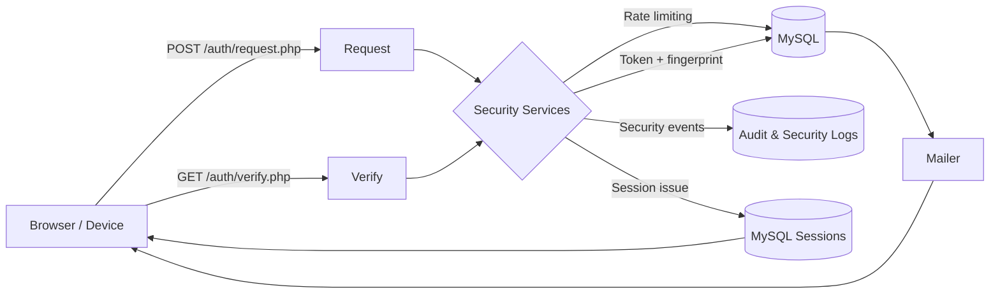

# Passless Architecture Overview

Passless keeps its moving parts intentionally small so the end-to-end authentication story is easy to explain during reviews or interviews.

## Key Components
- **Controllers** (`htdocs/index.php`, `htdocs/auth/*`, `htdocs/app.php`, `htdocs/admin.php`) orchestrate requests and responses.
- **Security Services** (`htdocs/lib/Security/*`) encapsulate token creation, verification, CAPTCHA requirements, rate limiting, GeoIP lookups, and session policies.
- **Persistence** (`htdocs/lib/DB/Connector.php`, `htdocs/database/install.sql`) provides PDO connectivity for MySQL in production and SQLite in automated tests.
- **Session Layer** (`DatabaseSessionHandler`, `SessionAuth`) persists sessions in MySQL with sliding expiration, optional absolute lifetimes, and revocation support.
- **Logging** (`htdocs/lib/Support/*`) records audit events, security signals, and operational logs.
- **Infrastructure** (`.github/workflows/deploy.yml`, `htdocs/deploy/cleanup.php`, `docs/DEPLOYMENT.md`) automates analysis, testing, deployment, and housekeeping.

## Error Handling Strategy
- **User-facing errors** stay generic to avoid account enumeration and timing leaks. Random jitter is introduced before returning failures.
- **Audit logs** capture granular context (reason, IP, selector) for forensic analysis.
- **Security events** flag notable patterns—rate-limit hits, fingerprint mismatches, lockouts—for dashboards or alerting.
- **Transport failures** (database or mail) raise typed exceptions derived from `PasslessException` so controllers can respond consistently.

Example: a failed verification always returns the same message to the browser. Behind the scenes the system logs whether the token was missing, expired, or invalid, along with the request IP, user agent, and rate-limit state. This preserves UX while equipping responders with the details they need.

For more depth, see `docs/THREAT_MODEL.md` for the adversary matrix and `docs/API.md` for detailed service reference notes.
